[](https://github.com/SermetPekin/micrograd/actions/workflows/python-package.yml?1)


## Acknowledgment

This project is a fork of [micrograd](https://github.com/karpathy/micrograd) by [Andrej Karpathy](https://github.com/karpathy), which is licensed under the MIT License. 

The original micrograd library served as the foundation for this project, providing a simple and elegant implementation of an automatic differentiation engine. All credit for the original implementation and its inspiration goes to Andrej Karpathy.

This fork includes additional features, improvements, and extensions to the original project to enhance its functionality and adapt it for new use cases. Special thanks to Andrej Karpathy for sharing his work with the community and making this project possible.


# micrograd
```bash 
git clone https://github.com/SermetPekin/micrograd.git
# usage with uv package (just like poetry / pipvenv but faster to create env and install dependencies)
pip install uv 
uv venv 
source .venv\scripts\activate
uv pip install . 
# run example 
python ./example.py
# for tests
pytest -v 

```

### Example usage

Below is a slightly contrived example showing a number of possible supported operations:

```python
from micrograd import Value

a = Value(-4.0)
b = Value(2.0)
c = a + b
d = a * b + b ** 3
c += c + 1
c += 1 + c + (-a)
d += d * 2 + (b + a).relu()
d += 3 * d + (b - a).relu()
e = c - d
f = e ** 2
g = f / 2.0
g += 10.0 / f
print(f'{g.data:.4f}')  # prints 24.7041, the outcome of this forward pass
g.backward()
print(f'{a.grad:.4f}')  # prints 138.8338, i.e. the numerical value of dg/da
print(f'{b.grad:.4f}')  # prints 645.5773, i.e. the numerical value of dg/db
```


### Neural Network Architecture

Here is a visual representation of the MLP architecture:

```mermaid
graph TD
    %% Styling for Neurons %%
    classDef inputNeuron fill:#e6f7ff,stroke:#1d4e89,stroke-width:2px
    classDef hiddenNeuron1 fill:#d9f7be,stroke:#389e0d,stroke-width:2px
    classDef hiddenNeuron2 fill:#f6e6ff,stroke:#722ed1,stroke-width:2px
    classDef outputNeuron fill:#fff1f0,stroke:#cf1322,stroke-width:2px

    %% Input Layer %%
    subgraph InputLayer ["🎯 Input Layer"]
        InputNeuron1["Neuron 1"]:::inputNeuron
        InputNeuron2["Neuron 2"]:::inputNeuron
        InputNeuron3["Neuron 3"]:::inputNeuron
    end

    %% Hidden Layer 1 %%
    subgraph HiddenLayer1 ["⚙️ Hidden Layer 1"]
        HiddenNeuron1_1["Neuron 1"]:::hiddenNeuron1
        HiddenNeuron1_2["Neuron 2"]:::hiddenNeuron1
        HiddenNeuron1_3["Neuron 3"]:::hiddenNeuron1
        HiddenNeuron1_4["Neuron 4"]:::hiddenNeuron1
    end

    %% Hidden Layer 2 %%
    subgraph HiddenLayer2 ["⚙️ Hidden Layer 2"]
        HiddenNeuron2_1["Neuron 1"]:::hiddenNeuron2
        HiddenNeuron2_2["Neuron 2"]:::hiddenNeuron2
    end

    %% Output Layer %%
    subgraph OutputLayer ["🔍 Output Layer"]
        OutputNeuron1["Neuron 1"]:::outputNeuron
        OutputNeuron2["Neuron 2"]:::outputNeuron
    end

    %% Connections Between Layers %%
    %% Input Layer to Hidden Layer 1 %%
    InputNeuron1 --> HiddenNeuron1_1
    InputNeuron1 --> HiddenNeuron1_2
    InputNeuron1 --> HiddenNeuron1_3
    InputNeuron1 --> HiddenNeuron1_4

    InputNeuron2 --> HiddenNeuron1_1
    InputNeuron2 --> HiddenNeuron1_2
    InputNeuron2 --> HiddenNeuron1_3
    InputNeuron2 --> HiddenNeuron1_4

    InputNeuron3 --> HiddenNeuron1_1
    InputNeuron3 --> HiddenNeuron1_2
    InputNeuron3 --> HiddenNeuron1_3
    InputNeuron3 --> HiddenNeuron1_4

    %% Hidden Layer 1 to Hidden Layer 2 %%
    HiddenNeuron1_1 --> HiddenNeuron2_1
    HiddenNeuron1_1 --> HiddenNeuron2_2

    HiddenNeuron1_2 --> HiddenNeuron2_1
    HiddenNeuron1_2 --> HiddenNeuron2_2

    HiddenNeuron1_3 --> HiddenNeuron2_1
    HiddenNeuron1_3 --> HiddenNeuron2_2

    HiddenNeuron1_4 --> HiddenNeuron2_1
    HiddenNeuron1_4 --> HiddenNeuron2_2

    %% Hidden Layer 2 to Output Layer %%
    HiddenNeuron2_1 --> OutputNeuron1
    HiddenNeuron2_1 --> OutputNeuron2

    HiddenNeuron2_2 --> OutputNeuron1
    HiddenNeuron2_2 --> OutputNeuron2
```

